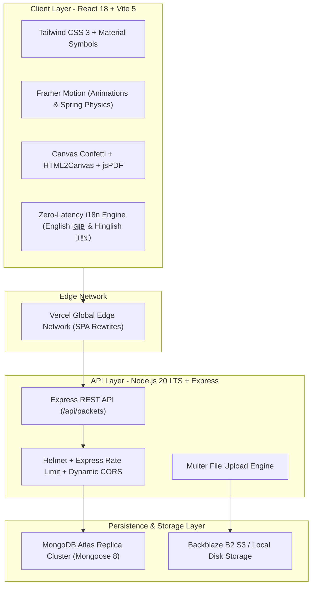
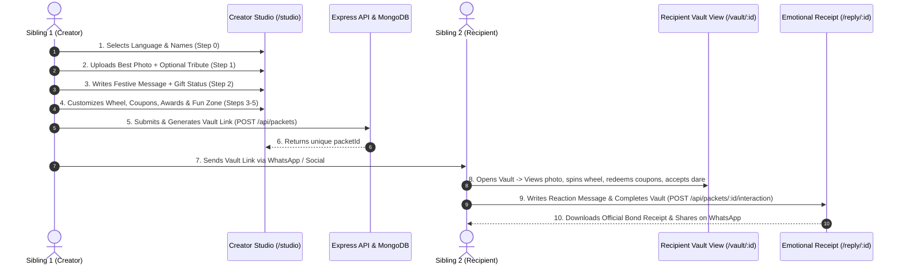

# 🎁 Sibling Vault — Complete Project Documentation & Technical Architecture Guide

> **A modern, interactive digital memory capsule & celebration platform for siblings — combining nostalgia, gamified bonding, commercial gift curation, and an emotional reply handoff.**

---

## 📌 1. Executive Summary & Vision

**Sibling Vault** (also known as *Family Bond Vault*) is a high-engagement, viral web application engineered to celebrate the unique, lifelong bond between siblings — perfectly suited for festivals like **Raksha Bandhan**, birthdays, or everyday appreciation.

### Key Value Proposition:
- **For the Sender**: Allows any brother or sister to create a personalized, interactive memory vault in under 3 minutes with zero friction.
- **For the Recipient**: Provides a delightful, gamified unboxing experience loaded with photos, secret notes, spin wheels, redeemable coupons, sibling dares, and crime fine calculators.
- **For the Creator/Platform**: Embeds curated commercial gift recommendations (Amazon, Flipkart, Nykaa, FNP, Blinkit, etc.) and a viral emotional reply loop that converts recipients into creators.

---

## 🏗️ 2. Technical Stack & Architecture



### Technology Breakdown:

| Layer | Technology | Purpose |
| :--- | :--- | :--- |
| **Frontend Core** | React 18 (SPA), Vite 5 | Reactive component architecture with instant HMR and optimized minified bundles (<500 kB). |
| **Styling & Design** | Tailwind CSS 3, Vanilla CSS | Warm festive color palette, typography tokens, glassmorphism, responsive grid layouts. |
| **Animations** | Framer Motion | Smooth entry transitions, hover lifts, modal drawer animations, accordion collapses. |
| **Gamification & Delights** | Canvas Confetti, HTML5 Canvas | Confetti bursts upon coupon redemption, physics-based canvas spin wheel. |
| **Export & Sharing** | `jspdf`, `html2canvas`, Web Share API | Instant PDF receipt downloads, certificate exports, and 1-tap WhatsApp sharing. |
| **Internationalization** | In-Memory Translation Engine | Real-time bilingual switching between English and Hinglish across all views. |
| **Backend Core** | Node.js 20 LTS, Express 4 | Lightweight REST API server with structured MVC controller architecture. |
| **Database** | MongoDB Atlas, Mongoose 8 | Cloud-hosted document database with automatic schema validation and indexing. |
| **Security & Middleware** | Helmet, Express-Rate-Limit, CORS | Header hardening, brute-force/upload throttling, and dynamic origin whitelisting. |
| **Media Storage** | Multer + Backblaze B2 / Local Disk | Secure image storage supporting portrait, landscape, and square aspect ratios. |

---

## 🧭 3. User Journey & End-to-End Workflow



---

## 📦 4. Detailed Feature Modules

### 🎨 Step 0: Setup & Language Selection
- **Bilingual Support**: Instant toggle between **English 🇬🇧** and **Hinglish 🇮🇳** (e.g., *"Bhai-Behen Ka Pyaara Sandesh"*).
- **Universal Sibling Design**: Gender-neutral phrasing that works seamlessly for brother-to-sister, sister-to-brother, or sibling-to-sibling.
- **Frictionless Creation**: All 5 feature modules are active by default — no confusing checkboxes or toggle requirements upfront.

### 📸 Step 1: Memory Photo & Sibling Love Tribute
- **Single Best Photo Upload**: Simplifies media upload to 1 memorable photo.
- **Adaptive Photo Frame (Zero Crop)**:
  - Dynamically renders portrait (9:16), landscape (16:9), or square (1:1) photos without cropping a single pixel.
  - Features an ambient blurred background matching the image colors + lightbox zoom.
- **Interactive Message Presets with Toggle**:
  - 3 curated tribute messages (Emotional, Mischievous, Protector/Friend).
  - **Toggle Select/Deselect**: Click once to select, click again to deselect, allowing users to send only a photo if desired.
- **Wax-Sealed Secret Message**: Optional locked note that remains hidden until the recipient taps to unlock with a wax-seal breaking animation.

### 💌 Step 2: Festival Wish & Curated Gift Stores
- **Heartfelt Festive Message**: Quick-pick message presets + custom text editor.
- **Curated Partner Store Catalog**:
  - Direct shopping links to top stores: **Amazon**, **Flipkart**, **Nykaa**, **Ferns N Petals (FNP)**, **Myntra**, **Blinkit**, **Zepto**, **Swiggy Instamart**.
- **Surprise Delivery Announcement**:
  - Creator can toggle *"Maine Gift Order Kiya"* with gift details.
  - **Conditional Recipient Card**: If checked, recipient sees a *"Surprise Gift on the Way! 🚚✨"* card without spoiling the secret product name. If unchecked, the card is cleanly omitted.

### 🎰 Step 3: The Punishment Wheel
- **Interactive Canvas Wheel**: 6 customizable punishments/dares with alternating vibrant colors.
- **Physics-Based Spin Animation**: Pointer deceleration, celebratory outcome modal, and *"Kismat Manzoor Hai 🤝"* acceptance.
- **Auto-Hide Logic**: If the creator leaves punishments empty, the entire wheel module is automatically hidden from the recipient view.

### 🎟️ Step 4: Sibling Coupons & Funny Awards
- **Redeemable Sibling Coupons**:
  - Presets like *"Free Hug Pass"*, *"24h Zero Arguments Pass"*, *"Midnight Maggi Pass"*, *"Late Night Drive"*.
  - Recipient can tap **"Redeem Now"** to trigger celebratory confetti bursts and live redemption tracking.
- **Official Funny Awards & Certificates**:
  - Presets like *"Official Maggi Thief"*, *"World's Loudest Sibling"*, *"Remote Control Monopolist"*, *"Drama Queen/King Supreme"*.
  - Custom certificate creator with downloadable PDF/PNG exports.
- **Auto-Hide Logic**: If no coupons or awards are added, this entire section is cleanly omitted.

### 🌶️ Step 5: Roast & Fun Zone
- **Feature 1: Sibling Roast Wall**: Relatable roasts with interactive **"100% Sach 🔥"** vs **"Jhooth / Fake News ❌"** voting buttons.
- **Feature 2: Catch My Dare / Sibling Challenge**: Single compact dare prompt (e.g. *"I dare you to let me draft your next WhatsApp status for 5 hours!"*) with interactive **[ Accept Dare 🎯 ]** toggle.
- **Feature 3: One Request Contract**: Official non-negotiable sibling favor request with acceptance / counter-offer buttons.
- **Feature 4: Funny Crime Fine Calculator**: Itemized receipt checklist for sibling crimes (*"Stealing clothes"*, *"Unanswered calls"*, *"Eating ice cream from fridge"*) with real-time fine calculation.
- **Auto-Hide Logic**: Each sub-feature only renders if populated. If none are added, the entire Fun Zone is hidden.

### 💌 Phase 2: Sister's Completion & Emotional Checkout Receipt (`/reply/:packetId`)
- **Interactive Completion Card**: Recipient rates the vault (1-5 stars), chooses their reaction emotion (Cried, Laughed, Touched), and writes a personal reply message.
- **The Emotional Receipt**:
  - Renders a stylized vintage thermal store receipt (`VAULT-PORTAL: SIBLING BOND RECEIPT`).
  - Itemizes memory score, coupons unlocked, fines levied, and personal reaction.
  - Includes **1-Tap WhatsApp Share** and **Download PDF Receipt**.

---

## 🗄️ 5. Database Schema & Data Models

### MongoDB `packets` Collection:

```javascript
{
  packetId: { type: String, unique: true, index: true },
  senderName: { type: String, required: true },
  recipientName: { type: String, required: true },
  language: { type: String, enum: ['en', 'hinglish'], default: 'en' },
  theme: { type: String, default: 'nostalgic' },
  
  // Timeline (Photo & Story)
  timeline: [{
    mediaUrl: String,
    mediaUrls: [String],
    mediaType: { type: String, enum: ['image', 'none'], default: 'image' },
    title: String,
    date: String,
    story: String,
    secretNote: String
  }],

  // Festive Message & Gift
  brotherMessage: String,
  giftOrdered: Boolean,
  orderedGiftName: String,
  orderedGiftNote: String,
  orderedGiftImage: String,

  // Punishment Wheel
  punishments: [String],

  // Coupons
  coupons: [{
    id: String,
    title: String,
    terms: String,
    redeemed: Boolean
  }],

  // Certificates
  certificates: [{
    id: String,
    awardTitle: String,
    description: String
  }],

  // Roast & Fun Zone
  roasts: [{
    id: String,
    text: String,
    trueVotes: Number,
    fakeVotes: Number
  }],
  secretChallenge: {
    question: String,
    challengeText: String
  },
  siblingFavor: {
    requestText: String,
    priority: String,
    status: String
  },
  fines: [{
    crimeTitle: String,
    amount: Number
  }],

  // Interaction State (Recipient Reply)
  interactions: {
    status: { type: String, enum: ['pending', 'completed'], default: 'pending' },
    reaction: String,
    rating: Number,
    replyMessage: String,
    completedAt: Date
  },

  createdAt: { type: Date, default: Date.now }
}
```

---

## 🌐 6. REST API Endpoints Specification

| Method | Endpoint | Description | Request Body / Params |
| :--- | :--- | :--- | :--- |
| `POST` | `/api/packets` | Creates a new memory vault packet | JSON `packet` payload |
| `GET` | `/api/packets/:packetId` | Retrieves a vault packet for recipient view | `packetId` (URL parameter) |
| `POST` | `/api/packets/upload` | Uploads memory photos | `multipart/form-data` (`mediaFiles`) |
| `PATCH` | `/api/packets/:packetId/coupon/:couponId` | Redeems a specific coupon voucher | `{ redeemed: true }` |
| `POST` | `/api/packets/:packetId/interaction` | Submits recipient's emotional reaction | `{ reaction, rating, replyMessage }` |
| `GET` | `/api/health` | Service health check | None |

---

## 🛡️ 7. Security, Reliability & Performance Engineering

1. **Defense-in-Depth Security**:
   - `helmet` middleware configures standard HTTP security headers to prevent XSS, clickjacking, and MIME sniffing.
   - `express-rate-limit` enforces rate limits (100 requests per 15 minutes for general API, 20 uploads per hour).
   - Strict CORS configuration whitelists localhost and production Vercel domains.

2. **Zero-Crop Responsive Layouts**:
   - Universal adaptive photo framing uses CSS `object-contain` + canvas color extraction to guarantee zero image cropping across all screen sizes.

3. **Performance Optimization**:
   - Rollup code-splitting and dynamic chunk compression keep the main JS bundle under **500 kB**.
   - Client-side static image preview eliminates redundant server roundtrips during draft editing.

---

## 💻 8. Local Setup & Production Runbook

### Prerequisites:
- Node.js 18+ (Node.js 20 LTS recommended)
- MongoDB running locally or a MongoDB Atlas URI

### Local Development:

```bash
# 1. Clone Repository & Setup Backend
cd backend
npm install
# Create .env file with:
# PORT=5000
# MONGO_URI=mongodb://localhost:27017/sibling_vault
# CLIENT_URL=http://localhost:5173
npm run dev

# 2. Setup Frontend
cd ../frontend
npm install
npm run dev
```

The application will be live at:
- **Frontend**: `http://localhost:5173`
- **Backend API**: `http://localhost:5000`

### Production Deployment:
- **Frontend (Vercel)**: Configured via root [`vercel.json`](file:///d:/All-Projects/family_bond_vault/family_bond_vault/my-sibling-vault/vercel.json) with SPA client-side rewrites. Set environment variable `VITE_API_URL` to your production backend URL.
- **Backend (Google Cloud Run / Railway / Render)**: Containerized with Dockerfile, exposing port 5000. Set `MONGO_URI`, `CLIENT_URL`, and `NODE_ENV=production`.

---

## 📄 9. Project Directory Tree

```
my-sibling-vault/
├── backend/
│   ├── src/
│   │   ├── controllers/      # packetController.js (CRUD, upload, interactions)
│   │   ├── models/           # Packet.js (Mongoose data models)
│   │   ├── routes/           # packetRoutes.js (Express API routing & Multer)
│   │   └── server.js         # Express app entry, security headers & DB connection
│   ├── package.json
│   └── .env
│
├── frontend/
│   ├── src/
│   │   ├── components/
│   │   │   ├── common/       # Navbar, Button, Modal, Toast, AdaptivePhotoFrame
│   │   │   ├── creator/      # TimelineBuilder, WishlistSetup, WheelCustomizer, 
│   │   │   │                 # CouponEditor, CertificateEditor, FunZoneEditor, LivePreview
│   │   │   └── recipient/    # MemoryTimeline, WishlistDisplay, SpinWheel, CouponCard,
│   │   │                     # CertificateCard, FunZoneDisplay, SisterCompletionCard
│   │   ├── context/          # PacketContext.jsx (Unified state management)
│   │   ├── data/             # affiliateStores.js (Curated partner catalog)
│   │   ├── hooks/            # usePacket.js, useMediaQuery.js
│   │   ├── i18n/             # translations.js (Bilingual English/Hinglish engine)
│   │   ├── pages/            # CreatorStudio.jsx, RecipientView.jsx, EmotionalReceipt.jsx
│   │   ├── services/         # api.js (Axios client with interceptors)
│   │   ├── App.jsx           # React Router route configuration
│   │   └── index.css         # Tailwind tokens & typography design system
│   ├── package.json
│   └── vite.config.js
│
├── PROJECT_DOCUMENTATION.md  # Comprehensive project architecture guide
├── README.md                 # Quick start guide
└── vercel.json               # Vercel deployment configuration
```

---

*Authored and maintained by the Core Engineering Team for Sibling Vault (Family Bond Vault).*
