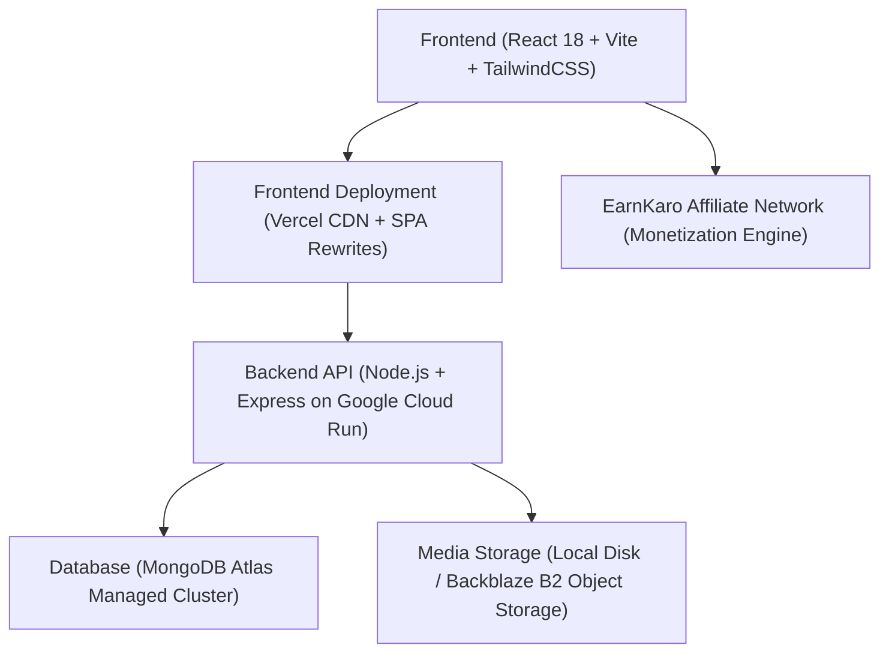
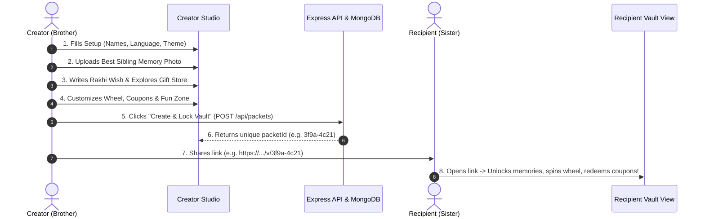

# 🎁 Sibling Vault — Complete Project Documentation & Architecture Guide

> **A personalized, interactive digital memory capsule & Raksha Bandhan celebration platform connecting siblings with nostalgia, gamified fun, and commercial gift curation.**

---

## 📌 Executive Summary

**Sibling Vault** (also known as *Family Bond Vault*) is a modern, high-engagement web application designed to celebrate sibling bonds—especially tailored for festive occasions like **Raksha Bandhan** and birthdays. 

Instead of sending ordinary text messages or generic greeting cards, a brother can craft a **personalized, interactive digital memory vault** for his sister in under 3 minutes. The recipient receives a unique shareable link that reveals cherished photos, secret locked messages, an interactive punishment spin wheel, custom redeemable sibling coupons, funny relatable roasts, and curated gift surprises.

---

## 🏗️ Technical Stack & Architecture



### 1. Frontend Technologies
- **Framework**: React 18 (SPA) with Vite 5 for ultra-fast HMR and optimized production bundles.
- **Styling & Design System**: TailwindCSS with a custom festive, warm nostalgic palette (`surface`, `primary`, `secondary`, `tertiary-fixed`, `outline-variant`).
- **Animations & Micro-interactions**: `framer-motion` (spring physics, layout morphing, modal reveals, accordion transitions).
- **Gamification & Delights**: `canvas-confetti` (for coupon redemptions & celebrations), CSS-based physics spin wheel.
- **Export & Sharing**: `jspdf` & `html2canvas` for downloadable personalized certificates, native Web Share API & clipboard copy.
- **Internationalization (i18n)**: Instant zero-latency switching between **English 🇬🇧** and **Hinglish 🇮🇳**.

### 2. Backend Technologies
- **Runtime & Server**: Node.js 20 (LTS) with Express.js.
- **Database ODM**: Mongoose 8 connected to **MongoDB Atlas** with retry logic and connection pooling.
- **Security & Protection**:
  - `helmet` (HTTP header security & CSP protection)
  - `express-rate-limit` (DDoS prevention & upload throttling)
  - Strict dynamic `cors` whitelisting for local dev and production Vercel domains.
- **File & Media Handling**: `multer` with file-type validation (JPG, PNG, WEBP, GIF, MP4) and sanitized filenames.

### 3. Cloud Deployment Infrastructure
- **Frontend Hosting**: **Vercel** (Global Edge CDN with `vercel.json` SPA rewrite rules).
- **Backend Hosting**: **Google Cloud Run** (Asia-South1 Mumbai region) running lightweight containerized Docker (`node:20-alpine`, non-root user).
- **Database**: **MongoDB Atlas** Multi-region Replica Cluster with TLS encryption.

---

## 🚀 How the Application Works (End-to-End Workflow)



---

## 📦 Core Feature Modules Detailed

### 1. Step 0: Setup & Language Selection
- Selects recipient name (Sister) and sender name (Brother).
- **Bilingual Switcher**: Instantly toggles the entire experience between **English** and **Hinglish** (e.g. *"Bhai Ka Dil Se Sandesh"*).
- **Visual Module Selector**: Allows enabling/disabling specific modules (Timeline, Punishment Wheel, Coupons, Fun Zone).

### 2. Step 1: Memory Photo & Sibling Love Tribute
- **Single Best Photo Upload**: Simplifies media upload to 1 memorable photo (e.g. last Raksha Bandhan, childhood throwback).
- **Adaptive Photo Frame (Zero Crop)**:
  - Dynamically adapts to **any aspect ratio** (portrait 9:16, landscape 16:9, square 1:1) without cropping a single pixel.
  - Generates an ambient blurred backdrop from the photo's own color palette with high-resolution lightbox zoom.
- **Auto-Generated Sibling Tribute**: Automatically pairs the photo with a heartfelt tribute celebrating sibling love.
- **Secret Note**: Optional confidential message that stays locked until the recipient taps to reveal.

### 3. Step 2: Raksha Bandhan Message & Curated Gift Store
- **Heartfelt Rakhi Message**: Quick-pick message presets + custom message textarea.
- **Commercial Affiliate Gift Showcase (EarnKaro Integration)**:
  - Curated high-converting Rakhi gift recommendations (Silver jewelry, chocolates, smart devices, beauty kits, ethnic bags).
  - Category filters, discount tags (up to 65% OFF), star ratings, and direct **"Buy Now / Best Deal Dekhein ↗"** buttons.
- **Surprise Delivery Announcement on Recipient Side**:
  - Automatically displays an exciting surprise gift arrival card to the sister without spoiling the secret product name!

### 4. Step 3: The Punishment Wheel 🎰
- Interactive, gamified spinning wheel loaded with funny sibling chores and dares (e.g., *"Make Maggi for me at midnight"*, *"Give me 100% control of the TV remote for a week"*).
- Physics-based spin animation with winning highlight sounds/effects.

### 5. Step 4: Sibling Coupons & Awards 🎟️
- Digital redeemable coupon vouchers (*"1 Free Ice Cream Treat"*, *"Get Out of Chore Free Card"*).
- Recipient can tap **"Redeem Now"** to trigger celebratory confetti and mark coupons as redeemed in real-time.
- Downloadable personalized Sibling Award Certificate.

### 6. Step 5: Roast & Fun Zone 🌶️
- **Sibling Roasts**: Relatable sibling banter (e.g. *"Takes 2 hours to get ready for a 5-minute errand"*).
- **Sibling Crime & Fine Calculator**: Playful fines for common sibling crimes (Stealing clothes, eating fridge snacks).
- **Secret Challenge & 1 Sibling Favor Request**.

---

## 🔒 Security & Performance Optimizations

| Feature | Implementation | Benefit |
| :--- | :--- | :--- |
| **DDoS & Spam Defense** | `express-rate-limit` (100 req/15min general, 20 uploads/hour) | Prevents server overload and spam abuse |
| **HTTP Security Headers** | `helmet` middleware | Prevents XSS, clickjacking, and MIME sniffing |
| **Cross-Origin Security** | Dynamic regex & exact whitelist CORS | Restricts API access strictly to trusted domains |
| **Zero-Crop Photo Engine** | CSS `object-contain` + ambient blur backdrop | Displays portrait & landscape images without distortion |
| **Fast Production Bundling** | Vite chunking + gzip compression (<155kB bundle) | Instant page loads even on 3G/4G mobile networks |

---

## 📈 Commercial & Monetization Strategy

1. **EarnKaro / Affiliate Commerce**: Seamlessly connects brothers to top trending Rakhi gifts with active affiliate links.
2. **Viral Loop**: Each created vault includes branding and a *"Create your own Sibling Vault"* button, turning every recipient into a potential creator.
3. **Zero Maintenance Overhead**: Serverless containerization scales down to 0 instances when idle, incurring minimal hosting costs.

---

## 💻 Local Development & Deployment Runbook

### Running Locally:
```bash
# 1. Start Backend (Runs on http://localhost:5000)
cd backend
npm install
npm run dev

# 2. Start Frontend (Runs on http://localhost:5173)
cd frontend
npm install
npm run dev
```

### Production Deployments:
- **Backend**: Containerized via Docker and deployed to **Google Cloud Run**.
- **Frontend**: Connected to Git repo and deployed via **Vercel** with dynamic API URL configuration.

---

*Authored by the Development Team for Sibling Vault (Family Bond Vault).*
